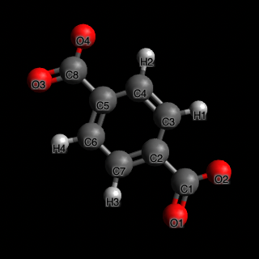
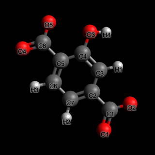
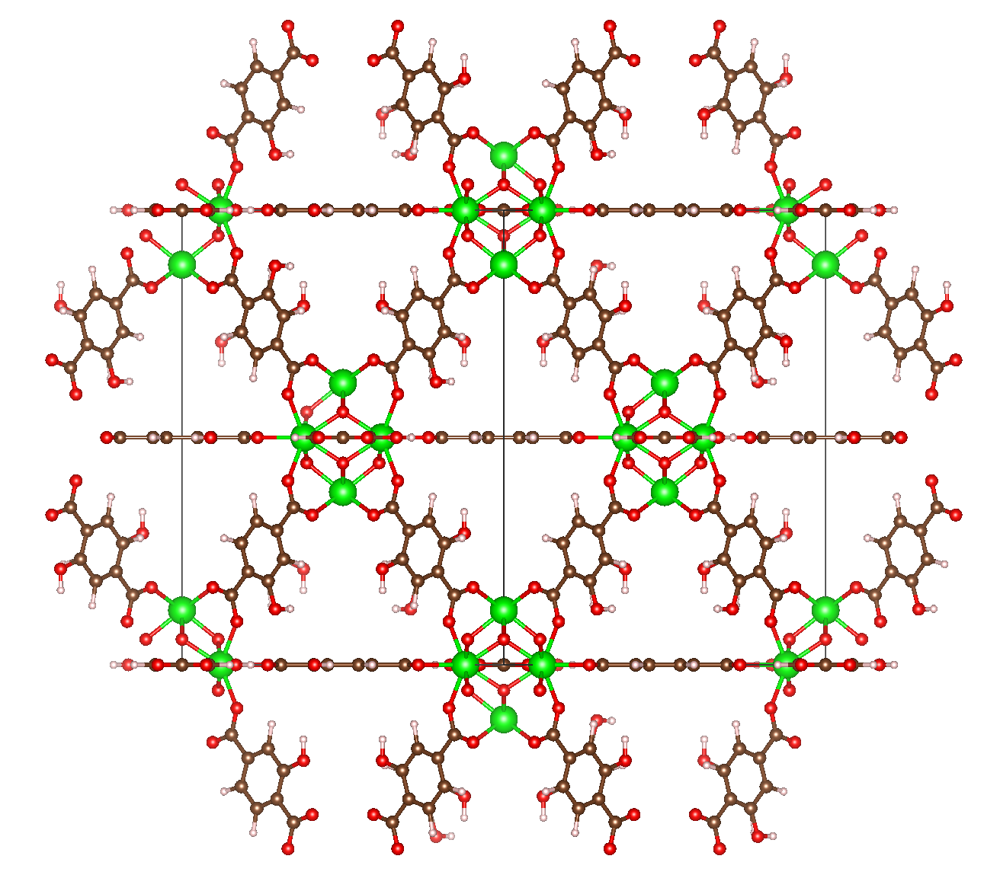
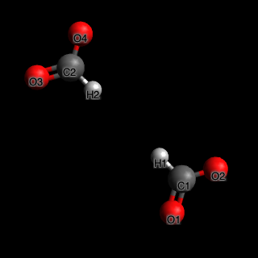
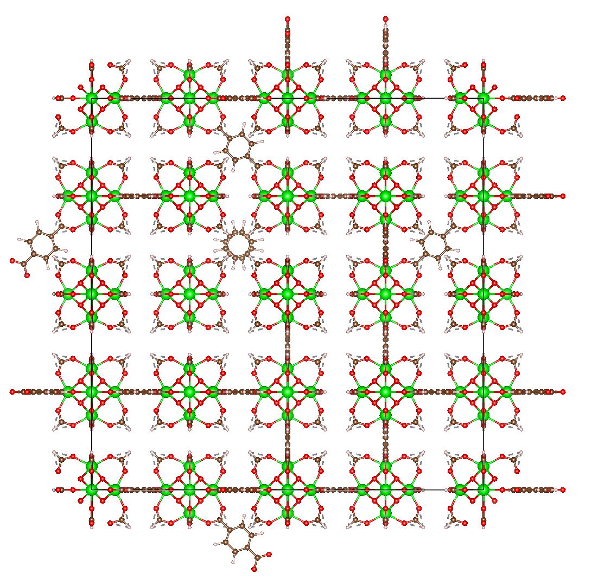

# Examples


## Example 1: functionalizing a MOF

For this example, we will take the UiO-66 MOF and functionalize its linker with a hydroxyl group. We have provided all
the files for this example, but if you were do this procedure on your own structure, you would need to take the
following steps:

* Prepare the structure file as a P1 CIF or a P1 LAMMPS data file.
* Prepare the search pattern. In this example, we are searching for the linker of UiO-66, which is a biphenyl linker. We
  used Vesta to pick one linker in the structure, deleted all other atoms, then exported to a file format that Avogadro
  can read. We opened the file in Avogadro and saved as CML.
* Prepare the replacement pattern. The replacement pattern needs to lie in the same coordinate system as the search
  pattern. The easiest way to do this is to start with the search pattern and simply not move any of the atoms unless
  you want to move them with the replacement operation. For this example, we took the search pattern CML, replaced one
  of the hydrogens on the biphenyl group with an oxygen atom, and added the attached hydrogen to make the hydroxyl. We
  used avogadro's "fix atoms" feature to fix all the atoms except for the newly added ones, then ran optimize structure
  to let the OH group find a more appropriate position. (Note that if you do not fix ALL the atoms except for the
  hydroxyls, many of the atoms will move when you optimize and the atoms of your replacement pattern may insert into an
  odd position!)

<figure markdown>
  
  <figcaption>Search pattern: UiO-66 linker</figcaption>
</figure>

<figure markdown>
  
  <figcaption>Replacement pattern: UiO-66 linker with hydroxyl functional group</figcaption>
</figure>

Once you have the files prepared, the find / replace operation is very simple. In Python:

```python
from mofun import Atoms, replace_pattern_in_structure

structure = Atoms.load("uio66.cif")
uio66_linker = Atoms.load("uio66-linker.cml")
uio66_linker_oh = Atoms.load("uio66-linker-w-hydroxyl.cml")

structure_oh = replace_pattern_in_structure(structure, uio66_linker, uio66_linker_oh)
structure_oh.save("uio66-w-hydroxyl.lmpdat")
```

In your shell:

```shell
mofun uio66.cif uio66-w-hydroxyl.cif -f uio66-linker.cml -r uio66-linker-w-hydroxyl.cml
```

If you look in the output uio66-w-hydroxyl.cif file, you will see the hydroxyls on all the linkers.

<figure markdown>
  
  <figcaption>UiO-66 with hydroxyls</figcaption>
</figure>

## Example 2: introducing defects into a MOF

For this example, we will introduce defects into UiO-66 by randomly removing linkers from the structure. We will first
replicate the structure to a 2x2x2 so it fulfills minimum image conventions. We do this before adding defects, so that
the defects aren't repeated in the structure. We will create defects for 10%, and 90% of all linkers. (Clearly, having
90% of linkers be defective would create a non-viable structure, but it is easier to visualize).

As in example 1, we will need to prepare the structure file, search pattern and replacement pattern. See above for
discussion on how we typically do that. We can use the structure and search pattern files from example 1, but we will
need a replacement pattern where the biphenyl ring is removed and there are formate caps where the linker would attach
to the metal center.

<figure markdown>
  
  <figcaption>Replacement pattern: UiO-66 defective linker</figcaption>
</figure>

In Python:

```python
from mofun import Atoms, replace_pattern_in_structure

structure = Atoms.load("uio66.cif").replicate((2,2,2))
uio66_linker = Atoms.load("uio66-linker.cml")
uio66_linker_defective = Atoms.load("uio66-linker-defective.cml")

defective10 = replace_pattern_in_structure(structure, uio66_linker, uio66_linker_defective, replace_fraction=0.10)
defective10.to_ase().write("uio66-defective-10.cif")

defective90 = replace_pattern_in_structure(structure, uio66_linker, uio66_linker_defective, replace_fraction=0.90)
defective90.to_ase().write("uio66-defective-90.cif")
```

In your shell:

```shell
mofun uio66.cif uio66-defective-10.cif -f uio66-linker.cml -r uio66-linker-defective.cml --replicate 2 2 2 --replace-fraction=0.10
mofun uio66.cif uio66-defective-90.cif -f uio66-linker.cml -r uio66-linker-defective.cml --replicate 2 2 2 --replace-fraction=0.90
```

<figure markdown>
  
  <figcaption>Structure with 90% defects</figcaption>
</figure>

## Example 3: parameterizing a replicated MOF using only parameterized linker and metal centers

For this example, we start with an unparameterized CIF file, and then we find and replace both the linker and the metal
center with parameterized versions, thus parameterizing the full structure across periodic boundaries. For this to
work, you will need to have overlapping patterns; the parameterized linker and the parameterized metal center will
share some atoms. This is necessary to define 3-body (angle) or 4-body (dihedral, improper) force field terms near the
edge of the pattern. If you have only two-body terms (i.e. bond) then the patterns only need to share the atom that
connects the metal center to the linker (so that all bonds are defined); if you have three-body terms, then an extra
atom will need to be shared; for four-body terms, another extra atom will be shared between the patterns.

* Prepare parameterized linker and metal center LAMMPS data files.

In Python:

```python
from mofun import Atoms, replace_pattern_in_structure

structure = Atoms.load("uio66.cif")
uio66_linker = Atoms.load("uio66-linker-w-Zr.cml")
uio66_linker_params = Atoms.load("uio66-linker-parameterized-w-Zr.lmpdat")
uio66_mc = Atoms.load("uio66-metal-center.cml")
uio66_mc_params = Atoms.load("uio66-metal-center-parameterized.lmpdat")

param1 = replace_pattern_in_structure(structure, uio66_mc, uio66_mc_params)
param2 = replace_pattern_in_structure(param1, uio66_linker, uio66_linker_params)
param2.save("uio66-parameterized.lmpdat")
```

In your shell:

```shell
mofun uio66.cif uio66-param1.lmpdat -f uio66-metal-center.cml -r uio66-metal-center-parameterized.lmpdat
mofun uio66-param1.lmpdat uio66-parameterized.lmpdat -f uio66-linker-w-Zr.cml -r uio66-linker-w-Zr-parameterized.lmpdat


```

While we use separate files above for clarity, it is also possible to use the parameterized files for both the search
and replace patterns, like this:

```shell
mofun uio66.cif uio66-half-parameterized.lmpdat -f uio66-linker-w-Zr-parameterized.lmpdat -r uio66-linker-w-Zr-parameterized.lmpdat
mofun uio66-half-parameterized.lmpdat uio66-fully-parameterized.lmpdat -f uio66-metal-center-parameterized.lmpdat -r uio66-metal-center-parameterized.lmpdat
```

This may be confusing at first glance, since we are finding the same pattern that we are replacing it with. However, the
find operation only looks at the positions of the atoms (and does not require that the force field terms match); for
the replace operation, all the atom positions stay the same but the appropriate force field terms are inserted.

To evaluate whether the final structure is valid, you will need to look at the resulting LAMMPS data file and check the
connectivity and the force field terms, since visually, the structure will look identical.

<!--
## Example 4: searching the CoRE database for UIO-66 analogs

TODO
 -->

